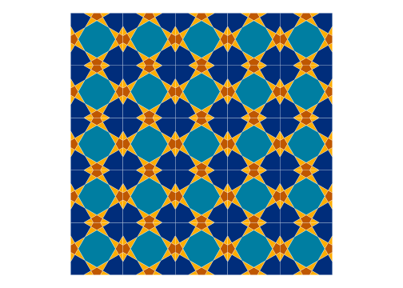

<!-- README.md is generated from README.Rmd. Please edit that file -->

```{r, include = FALSE}
knitr::opts_chunk$set(
  collapse = TRUE,
  comment = "#>",
  fig.path = "man/figures/README-",
  out.width = "100%",
  dev = "svg"
)
```

<a href={https://github.com/Ehyaei/Kaashi}>

# Kaashi (Tile)

```{r, echo = FALSE, results='asis', message=FALSE}
cat(
  badger::badge_devel("Ehyaei/Kaashi", "orange"),
  badger::badge_lifecycle("experimental"),
  badger::badge_last_commit("Ehyaei/Kaashi")
)
```

The art of tiling has long been used to decorate homes and holy places in Iran. One of the masterpieces of this art can be found in Isfahan's Sheikh Lotfollah Mosque.

<a>

The purpose of this package is to create Islamic pattern using R functions.
To generate Islamic patterns, we employ the Hankin method, as described in Craig S. Kaplan's paper Islamic Star Patterns from Polygons in Contact. This paper investigates geometric vocabulary for designing star shape patterns.

<a>

In the first step of Hankin’s method, a pair of rays is associated with every
contact position on every tile. A single contact position gets its two rays, 
Each of which forms the contact angle $\theta$ with the edge and ​separate the 
ray origins by distance $\delta$.

```{r tile, fig.height=3}
library(Kaashi)
library(ggplot2)
tile <- motif(theta = 45, delta = 0.5, polyLine = T, drawBox = T)
tilePlotter(tile)
```

By repeating the patterns designs, larger designs can be produced on the page.

<center>
<a>
</center>

```{r tiling, fig.height=3}
vector = rbind(
  c(2,0),
  c(0,2))
tiles <- tiling(tile,n = 4, type = "periodic",vector = vector) 
tilePlotter(tiles)
```

`motif` function implements Hankin’s method. The output of the function is sf class that can be polylines or polygons. In polygons case, sf data.frame have two fields area and name.
You can set fill parameter area or name for coloring shape. 

```{r}
tile <- motif(theta = 45, delta = 0.5, polyLine = F)
head(tile)
```

To plot patterns use `tilePlotter` function. 

```{r tiling_45_0.5, fig.height=3}
tile <- motif(theta = 45, delta = 0.5, dist = 0.05, polyLine = F)
tiles <- tiling(tile, n = 5)
tilePlotter(tiles,tileColor = c("#FFAD00","#002D7B","#007EA1"),borderSize = 0.01)
```

Below, examples of triangle, square, and hexagonal tiling can be found.

<table width="100%" border="0">
  <tr>    
  <td>
  
  </td>
  <td>
  
  </td>
  </tr>
  <tr>
  <td>
  
  </td>
  <td>
  </td>
  </tr>
</table>

## Installation

You can install the development version of Kaashi from [GitHub](https://github.com/ehyaei/Kaashi) with:

``` r
# install.packages("devtools")
devtools::install_github("ehyaei/Kaashi")
```

## Refrences

- [Islamic Star Patterns from Polygons in Contact](https://citeseerx.ist.psu.edu/viewdoc/download?doi=10.1.1.90.5930&rep=rep1&type=pdf)
- [Islamic Geometric Patterns](https://vamshij.com/blog/2020-01-28-islamic-geometric-patterns/#regular-and-archimedean-tilings)

