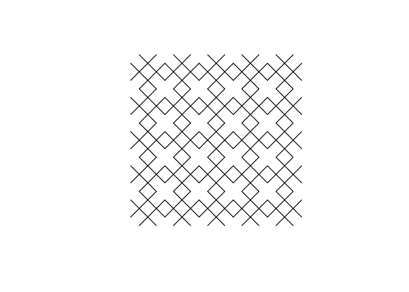

<!-- README.md is generated from README.Rmd. Please edit that file -->

# Kaashi

<!-- badges: start -->
<!-- badges: end -->

The goal of Kaashi is to …

## Installation

You can install the development version of Kaashi from
[GitHub](https://github.com/) with:

``` r
# install.packages("devtools")
devtools::install_github("ehyaei/kaashi")
```

## How Create Kashi

``` r
library(Kaashi)
plot(kaashi(tarh(theta = 45, delta = 0.5), n = 5))
```


