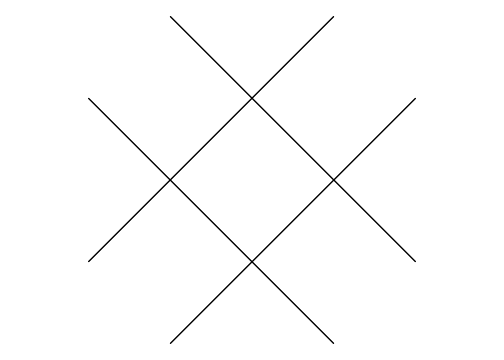
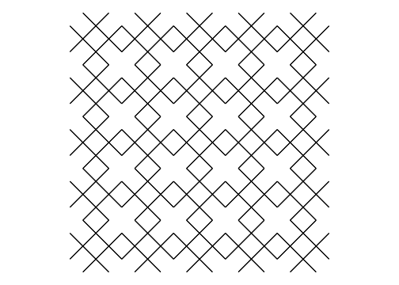
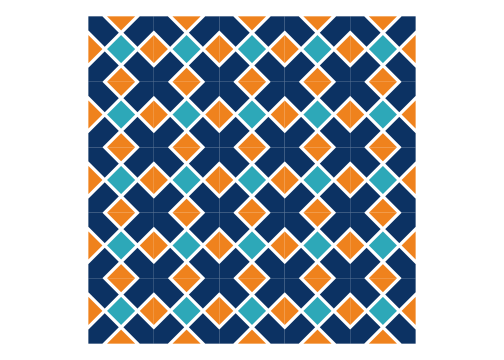
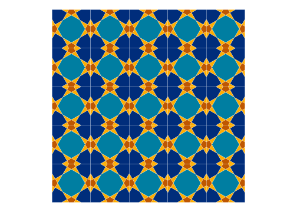
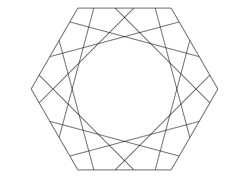
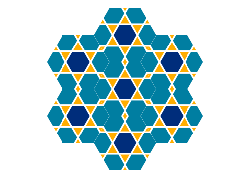

<!-- README.md is generated from README.Rmd. Please edit that file -->

<a href={https://github.com/Ehyaei/Kaashi}>

# Kaashi (Tile)

[](https://github.com/Ehyaei/Kaashi)
[](https://lifecycle.r-lib.org/articles/stages.html#experimental)
[](https://github.com/Ehyaei/Kaashi/commits/main)

The art of tiling has long been used to decorate homes and holy places
in Iran. One of the masterpieces of this art can be found in Isfahan’s
Sheikh Lotfollah Mosque.

<a>

The purpose of this package is to create Islamic pattern using R
functions.

## Installation

You can install the development version of Kaashi from
[GitHub](https://github.com/ehyaei/Kaashi) with:

``` r
# install.packages("devtools")
devtools::install_github("ehyaei/Kaashi")
```

## How Create Kashi

``` r
library(Kaashi)
library(ggplot2)
# Create Simple Pattern
tile <- pattern(theta = 45, delta = 0.5, polyLine = T)
tilePlotter(tile)
```



``` r
# Tilling page with Pattern
tiling <- tessellation(tile, n = 5)
tilePlotter(tiling)
```



``` r
tile <- pattern(theta = 45, delta = 0.5, dist = 0.05, polyLine = F)
tiling <- tessellation(tile, n = 5)
tilePlotter(tiling,tileColor = c("#EF821D","#2eb6c2","#0C3263"),borderSize = 0.01)
```



``` r
tile <- pattern(theta = 30, delta = 0.5, polyLine = F)
tiling <- tessellation(tile, n = 5)
tilePlotter(tiling,tileColor = c("#FFAD00","#FFAD00","#BF5700","#002D7B","#007EA1"),
            borderSize = 0.1)
```



``` r
# Hexagonal Box
s3 = sqrt(3)
hexagonal = rbind(c(-1,0), c(1,0), c(2,s3), c(1,2*s3), c(-1,2*s3),c(-2,s3),c(-1,0))
tile <- pattern(theta = 45, n = 6, delta = 0.2, start_points = c(0,0),
                box = hexagonal, drawBox = T, polyLine = T)
tilePlotter(tile)
```



``` r
tile <- pattern(theta = 60, n = 6, delta = 0.2, 
                start_points = c(0,0), box = hexagonal, dist = 0.05, polyLine = F)
tiling <- tessellation(tile,n = 2, type = "6-3", box = hexagonal)

tilePlotter(tiling,tileColor = c("#FFAD00","#FFAD00","#007EA1","#002D7B"),
            borderSize = 0.1)
```


