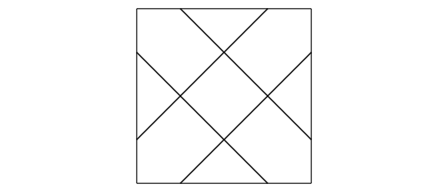
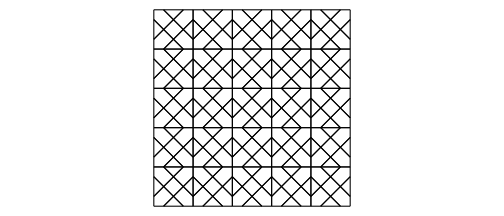
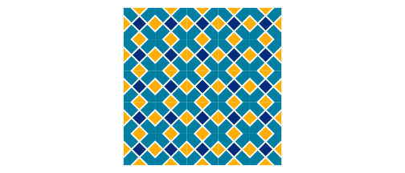
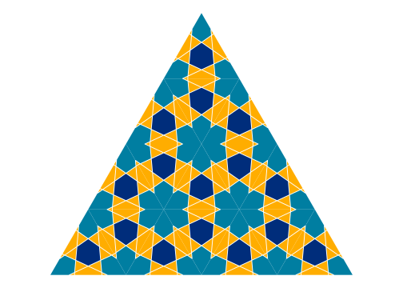

<!-- README.md is generated from README.Rmd. Please edit that file -->

<a href={https://github.com/Ehyaei/Kaashi}>

# Kaashi (Tile)

[](https://github.com/Ehyaei/Kaashi)
[](https://lifecycle.r-lib.org/articles/stages.html#experimental)
[](https://github.com/Ehyaei/Kaashi/commits/main)

The art of tiling has long been used to decorate homes and holy places
in Iran. One of the masterpieces of this art can be found in Isfahan’s
Sheikh Lotfollah Mosque.

<a>

The purpose of this package is to create Islamic pattern using R
functions. To generate Islamic patterns, we employ the Hankin method, as
described in Craig S. Kaplan’s paper Islamic Star Patterns from Polygons
in Contact. This paper investigates geometric vocabulary for designing
star shape patterns.

<a>

In the first step of Hankin’s method, a pair of rays is associated with
every contact position on every tile. A single contact position gets its
two rays, Each of which forms the contact angle *θ* with the edge and
​separate the ray origins by distance *δ*.

``` r
library(Kaashi)
library(ggplot2)
tile <- motif(theta = 45, delta = 0.5, polyLine = T, drawBox = T)
tilePlotter(tile)
```



By repeating the patterns designs, larger designs can be produced on the
page.

<center>
<a>
</center>

``` r
vector = rbind(
  c(2,0),
  c(0,2))
tiles <- tiling(tile,n = 4, type = "periodic",vector = vector) 
tilePlotter(tiles)
```



`motif` function implements Hankin’s method. The output of the function
is sf class that can be polylines or polygons. In polygons case, sf
data.frame have two fields area and name. You can set fill parameter
area or name for coloring shape.

``` r
tile <- motif(theta = 45, delta = 0.5, polyLine = F)
head(tile)
#> Simple feature collection with 6 features and 2 fields
#> Geometry type: POLYGON
#> Dimension:     XY
#> Bounding box:  xmin: -1 ymin: 0 xmax: 0.4985858 ymax: 2
#> CRS:           NA
#>   name  area                       geometry
#> 1  R01 0.249 POLYGON ((0.4985858 0, -0.4...
#> 2  R02 0.623 POLYGON ((-0.5014142 0, -1 ...
#> 3  R03 0.249 POLYGON ((-1 0.5014142, -1 ...
#> 4  R04 0.623 POLYGON ((-1 1.501414, -1 2...
#> 5  R05 0.497 POLYGON ((-2.168404e-19 1.4...
#> 6  R06 0.249 POLYGON ((-0.4985858 2, 0.4...
```

To plot patterns use `tilePlotter` function.

``` r
tile <- motif(theta = 45, delta = 0.5, dist = 0.05, polyLine = F)
tiles <- tiling(tile, n = 5)
tilePlotter(tiles,tileColor = c("#FFAD00","#002D7B","#007EA1"),borderSize = 0.01)
```



Below, examples of triangle, square, and hexagonal tiling can be found.

<table width="100%" border="0">
<tr>
<td>

</td>
<td>

</td>
</tr>
<tr>
<td>

</td>
<td>
</td>
</tr>
</table>

## Installation

You can install the development version of Kaashi from
[GitHub](https://github.com/ehyaei/Kaashi) with:

``` r
# install.packages("devtools")
devtools::install_github("ehyaei/Kaashi")
```

## Refrences

-   [Islamic Star Patterns from Polygons in
    Contact](https://citeseerx.ist.psu.edu/viewdoc/download?doi=10.1.1.90.5930&rep=rep1&type=pdf)
-   [Islamic Geometric
    Patterns](https://vamshij.com/blog/2020-01-28-islamic-geometric-patterns/#regular-and-archimedean-tilings)
