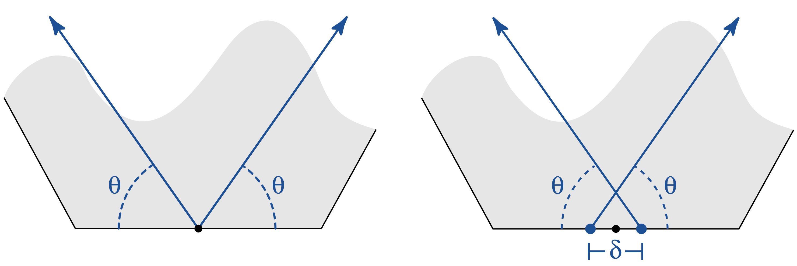

```{r, include = FALSE}
knitr::opts_chunk$set(
  collapse = TRUE,
  comment = "#>",
  fig.align = "center",
  fig.width = 5
)
```

```{r setup}
library(Kaashi)
library(ggplot2)
library(dplyr)
library(sf)
```

The goal of motif function is to produce a polygon or polyline pattern for each tile shape.
In Hankin's method, two rays grow from a pair of points equidistant from the edge’s midpoint. 
To generate Islamic patterns, we employ the Hankin method. Shapes are made from the intersection of these rays.

<center>
<a>
</center>

As mentioned before to generation motifs we need:

- polygon
- midpoint of one side
- $\theta$, the angle of rays respect polygon edge between 0 to 90
- $\delta$, the distance of rays source points from the edge’s midpoint between -0.5 to 0.5
- n, number of polygon edges

The function `regularPolygon` is useful to create regular polygon vertices. 
This function produces a regular polygon with sides of length one such that its first side is on the x-axis (fro (-1,0) to (1,0)).
In this case the origin is polygon side's midpoint. In the default setting `regularPolygon` is matrix of that each row is vertex

```{r}
hexagonal = regularPolygon(6)
hexagonal %>% as.data.frame() %>% 
ggplot(aes(x = V1, y  = V2))+
  geom_polygon(fill = "transparent",color = "black")+
  geom_point()+
  theme_bw() + labs(x = "X", y = "Y")+
  coord_fixed()
```

If set `sf = TRUE` in `regularPolygon`, the output is sf class object and has area and name columns.
This option is good for cases where you want to combine simple polygons to make a motif.

```{r}
hexpoly = regularPolygon(6,sf = T)
tilePlotter(hexpoly)
```

To create motifs, we need set $\theta$ and $\delta$.

```{r}
tile <- motif(hexagonal,n = 6,theta = 45, delta = 0.5,polyLine = T, drawBox = T)
tilePlotter(tile)
```

If set `polyLine = T` the output object is sf calss of polygons with name and area columns.

```{r}
square = regularPolygon(4)
tile <- motif(square,n = 4,theta = 45, delta = 0.3, polyLine = F)
head(tile)
tilePlotter(tile)
```

As it can be seen tile tile object includes `r length(unique(tile$name))` regions and
`r length(unique(tile$area))` different area. 

```{r}
pal <- colorRampPalette(c("#FFAD00","#002D7B","#007EA1"))
tileColors = pal(length(unique(tile$name)))
tilePlotter(tile, fill = "name",tileColor = tileColors)+
  geom_sf_label(aes(label = name),color = "black")

tileColors = tileColors = pal(length(unique(tile$area)))
tilePlotter(tile, fill = "area",tileColor = tileColors)+
  geom_sf_label(aes(label = area),color = "black")
```

To modify distance between polygons in `motif` use `dist` option.

```{r}
tile <- motif(square,n = 4,theta = 45, delta = 0.3, polyLine = F,dist = 0.1)
tilePlotter(tile)
```

## Combination of Motifs

It is possible to combine motifs through transfer and rotation.
In this way, we can use semi-regular or Archimedean tilings.
The following is an example of this type.

```{r}
oc = regularPolygon(8)
sq = regularPolygon(4)
octagonal = motif(box = oc, theta = 45, delta = 0.5, n = 8, polyLine = F)
square = motif(box = sq, theta = 45, delta = 0.5, n = 4, polyLine = F)
s1 = square %>% mutate(geometry = geometry + (oc[3,]-sq[1,]))
s2 = square %>% mutate(geometry = geometry + (oc[6,]-sq[1,]))
tile = rbind(octagonal,s1,s2)
tilePlotter(tile)
```

