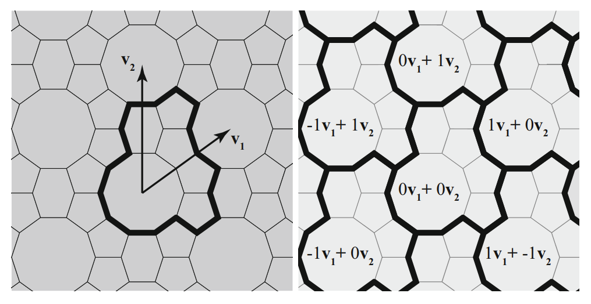

```{r, include = FALSE}
knitr::opts_chunk$set(
  collapse = TRUE,
  comment = "#>",
  fig.width = 5,
  fig.align = "center"
)
```

```{r setup}
library(Kaashi)
library(ggplot2)
```

By repeating the patterns designs, larger designs can be produced on the page.
There are several ways to tiling the Euclidean page.  The one of the simplest method is periodic tilings.
The idea periodic tilings is that the entire tiling can be created by assembling transformed copies of the original tile, 
translated by vectors $av_1 + bv_2$ where $v_1$ and $v_2$ are basis transformation vectors and a, b are integers.

<center>
<a>
</center>

```{r tiling_30_0.5}
tile <- motif(theta = 30, delta = 0.5, polyLine = F)
vector = rbind(
  c(2,0),
  c(0,2))
tiles <- tiling(tile,n = 4, type = "periodic",vector = vector) 

tilePlotter(tiles)
tilePlotter(tiles, tileColor = c("#FFAD00","#FFAD00","#BF5700","#002D7B","#007EA1"),
            borderSize = 0.1)
```

Below is a non-trivial example of Archimedean tilings.

```{r tile_composition}
oc = regularPolygon(8)
sq = regularPolygon(4)

octagonal = motif(box = oc, theta = 45, delta = 0.5, n = 8, polyLine = F)
square = motif(box = sq, theta = 45, delta = 0.5, n = 4, polyLine = F)

s1 = square %>% mutate(geometry = geometry + (oc[3,]-sq[1,]))
s2 = square %>% mutate(geometry = geometry + (oc[6,]-sq[1,]))
tile = rbind(octagonal,s1,s2)
tileColors = c("#48C1B8","#48C1B8","#BF5700","#FFAD00","#007EA1","#FFAD00")
tilePlotter(tile,tileColor = tileColors)
vector = rbind(
  c(4+4*cos(pi/4),0),
  oc[4,]-oc[1,])
tiles <- tiling(tile,n = 4, type = "periodic",vector = vector) 
tilePlotter(tiles, tileColor = tileColors,
            borderSize = 0.001)
```

## Triangle Tiling

The triangle tiling method tries to tessellation equilateral triangles by repeating them in all three directions.

```{r triangle_tiling}
triangale = regularPolygon(3) 
tile <- motif(box = triangale, theta = 25,delta = 0.5,n = 3, polyLine = F,dist = 0.01)
tiles <- tiling(tile, n = 2, box = triangale,type = "triangle")
tilePlotter(tiles, tileColor = c("#FFAD00","#FFAD00","#FFAD00","#007EA1","#002D7B"),
            borderSize = 0.001)
```   

## Hexagonal Tiling

Hexagonal Tiling tries to fill the page with hexagons and create big hexagon.

```{r hexagonal_tiling}
hexagonal = regularPolygon(6) 
tile <- motif(theta = 60, n = 6, delta = 0.2, 
                 box = hexagonal, dist = 0.05, polyLine = F)
tiles <- tiling(tile, n = 2, type = "hexagonal", box = hexagonal)

tilePlotter(tiles, tileColor = c("#FFAD00","#FFAD00","#007EA1","#002D7B"),
            borderSize = 0.1)
```


